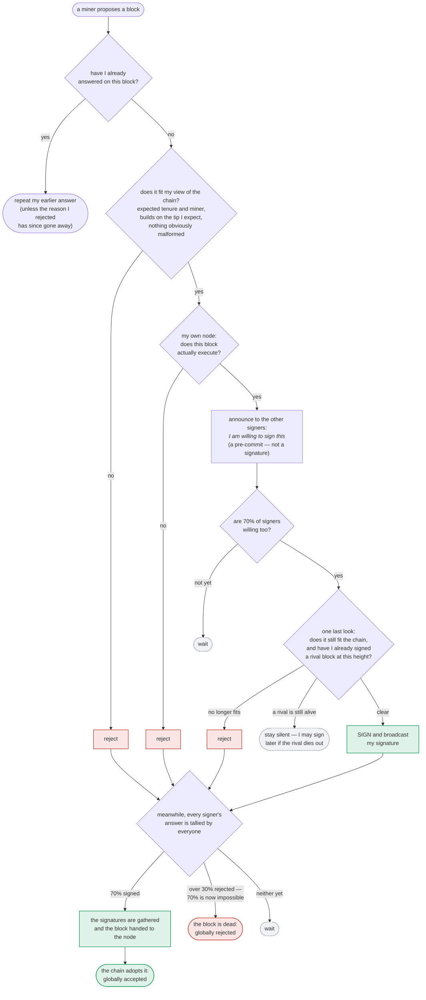
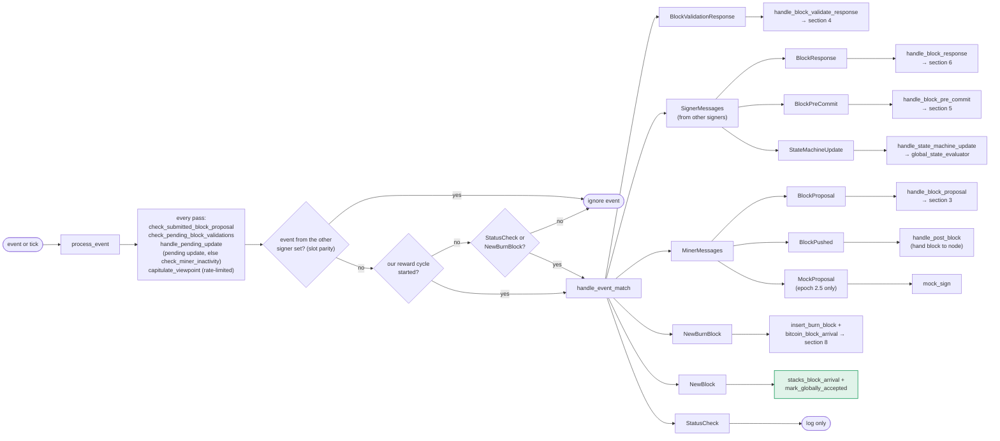
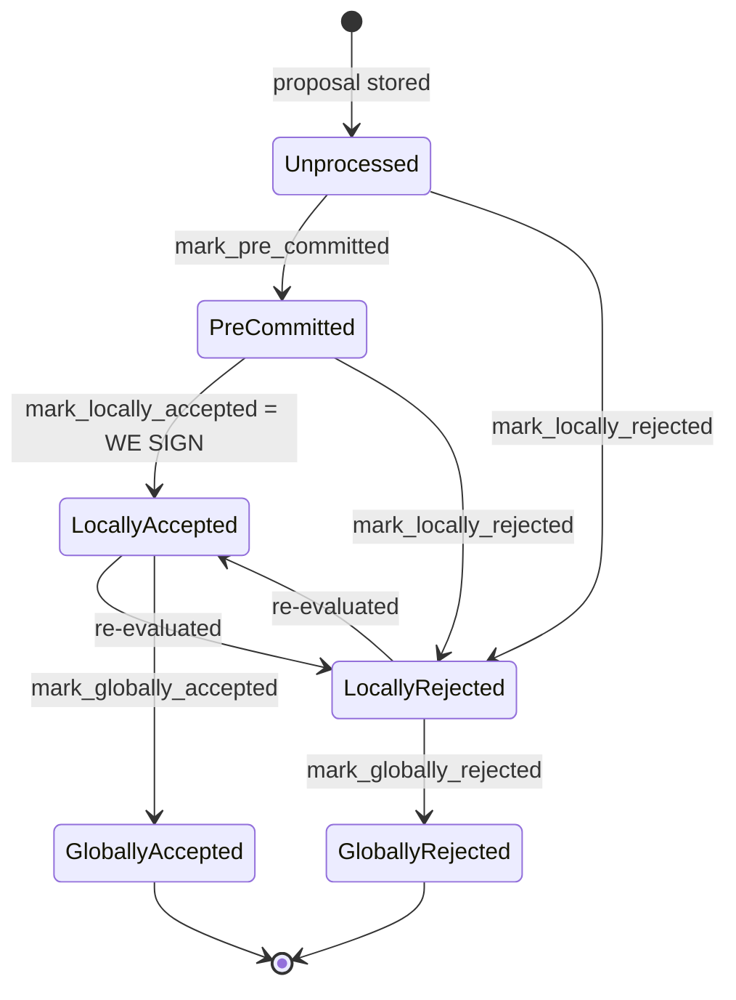
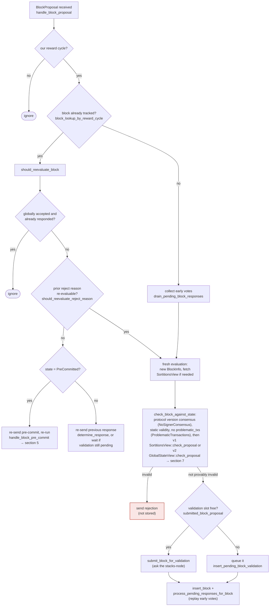
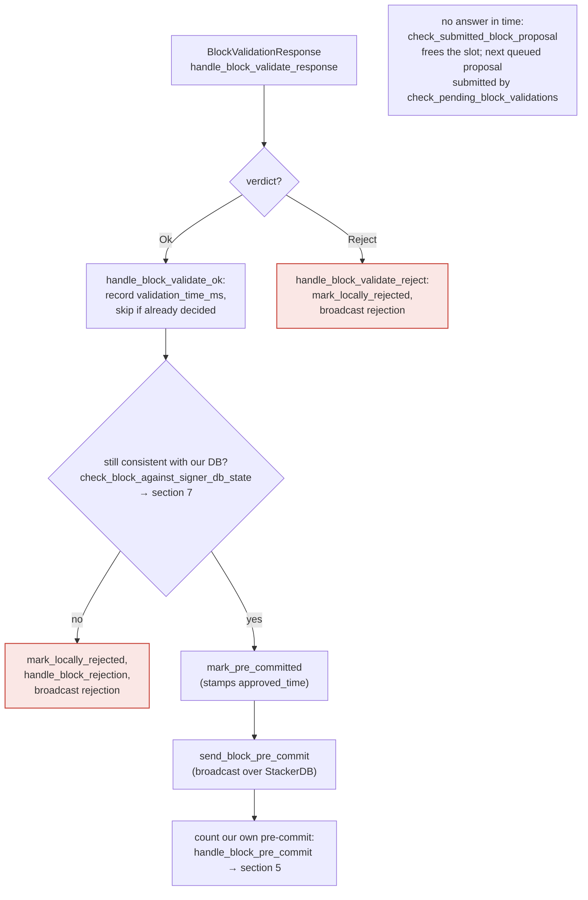
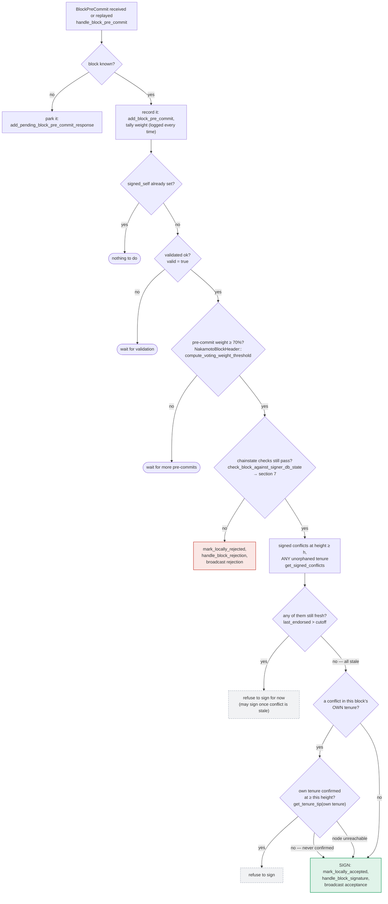
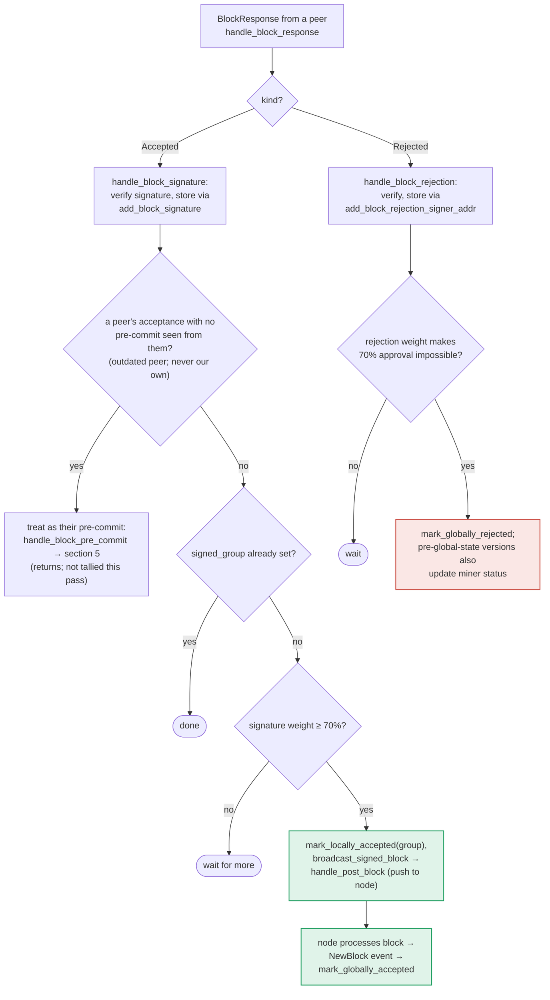
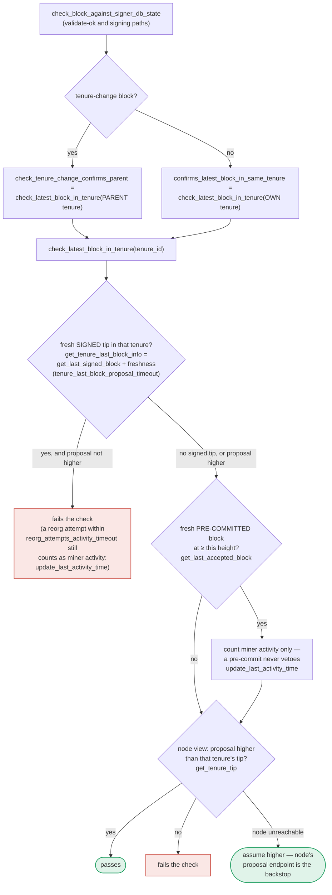
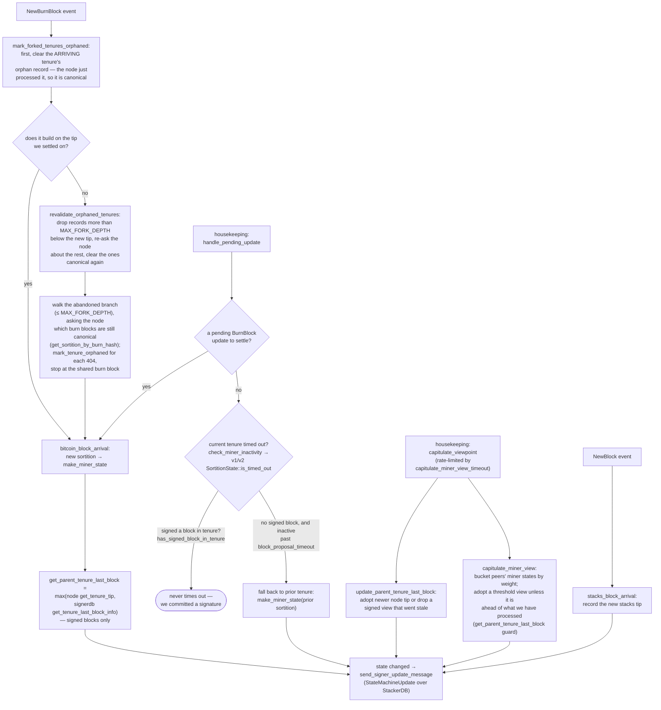

# Stacks Signer: Event & Decision Map

A decision map of the v0 signer (`stacks-signer/src/v0/`): every event it
receives, every branch it takes, and every message it emits, with the function
that owns each step.

How to read the diagrams:

- 🟢 **green**: puts a signature over a block, or accepts it
- 🔴 **red**: broadcasts a rejection
- ⬜ **dashed gray**: refuses silently; may retry later

## 0. The life of a block proposal (conceptual)

Before the mechanics: what a proposal goes through, in plain terms. Signing is
deliberately split into two rounds. First each signer says only _"I am willing to
sign this"_ — a **pre-commit**, which carries no signature and commits nothing.
Only once 70% of the weight has said that does anyone actually sign. The gap
between the two rounds is where most of the subtlety lives: time passes, the
burn chain can fork, and another block may win the same slot, so a signer takes
one last look at the world before its signature — the one irreversible act —
leaves the box.

Three things this shape is built to guarantee:

- **A signature is never given away cheaply.** Every red path is a broadcast
  verdict others can count; every gray path is silence that leaves the door open.
  A signer that cannot yet safely sign says nothing rather than rejecting.
- **Nobody signs alone.** The pre-commit round means a signer only spends its
  signature once it knows a supermajority intends to spend theirs, so a block
  that will never reach 70% rarely collects stray signatures at all.
- **Adoption is the ground truth.** Reaching 70% signatures makes a block
  _signable and pushable_; it counts as globally accepted only when the node
  reports having processed it.

Everything below is the same journey with the actual events, thresholds, and
functions attached.

Function names are given instead of line numbers so the references survive
refactors. Key files:

| File                                                                                                                             | Contents                                                           |
| -------------------------------------------------------------------------------------------------------------------------------- | ------------------------------------------------------------------ |
| [`stacks-signer/src/v0/signer.rs`](../stacks-signer/src/v0/signer.rs)                                                            | event loop, block proposal/validation/pre-commit/response handling |
| [`stacks-signer/src/v0/signer_state.rs`](../stacks-signer/src/v0/signer_state.rs)                                                | local state machine, miner view, capitulation                      |
| [`stacks-signer/src/chainstate/mod.rs`](../stacks-signer/src/chainstate/mod.rs)                                                  | shared chainstate checks (`check_latest_block_in_tenure`, …)       |
| [`stacks-signer/src/chainstate/v1.rs`](../stacks-signer/src/chainstate/v1.rs) / [`v2.rs`](../stacks-signer/src/chainstate/v2.rs) | protocol-version-specific proposal checks and miner timeout        |
| [`stacks-signer/src/signerdb.rs`](../stacks-signer/src/signerdb.rs)                                                              | `BlockInfo`/`BlockState`, block queries, conflict queries          |

## 1. The event loop & dispatch

Every pass through `process_event`, whether an event arrived or the loop just
ticked, runs the same housekeeping before dispatch: retire a timed-out
validation submission, submit the next queued proposal, settle any pending
state-machine update (or, if none is pending, check the current miner for
inactivity), and consider capitulating the miner view. If the local state
machine changed, a `StateMachineUpdate` is broadcast over StackerDB both before
and after the event is handled.

A `NewBlock` event is the node announcing a processed block: it is the only path
that marks a block _globally accepted_ without counting signatures. Seeing the
chain adopt the block is the ground truth.

`StatusCheck` and `NewBurnBlock` are the two events a signer handles before its
own reward cycle has started; everything else is dropped until then. The parity
gate is separate and unconditional: `SignerMessages` carry the signer set they
came from, and the opposite-parity set's traffic is never processed.

> Anchors: `process_event`, `handle_event_match`,
> `check_submitted_block_proposal`, `check_pending_block_validations`,
> `handle_post_block`, `mock_sign` (signer.rs); `handle_pending_update`,
> `check_miner_inactivity`, `capitulate_viewpoint` (signer_state.rs)

## 2. Block lifecycle (`BlockState`)

Every proposal tracked in the signer DB carries a `BlockState`. **`PreCommitted`
carries no signature**: it means "validated, willing to sign if the pre-commit
threshold is met." The first signature appears at `mark_locally_accepted`.
Global states are terminal against each other.

Canonical paths shown; the exact rule in `BlockInfo::check_state` is: either
local state is reachable from anything not yet global, `PreCommitted` only from
`Unprocessed`, and each global state is unreachable from the other.

Timestamps: `approved_time` is stamped at pre-commit _or_ local acceptance
(first wins), `signed_self` only when we sign, `signed_group` when the group
threshold is observed.

> Anchors: `BlockInfo::check_state`, `move_to`, `mark_pre_committed`,
> `mark_locally_accepted`, `mark_globally_accepted`, `mark_locally_rejected`,
> `mark_globally_rejected` (signerdb.rs)

## 3. A block proposal arrives

The miner broadcasts a proposal. If we've seen this exact block before,
`should_reevaluate_block` decides whether the old verdict stands; a block we
only pre-committed to is deliberately routed back through the pre-commit
evaluation so a re-proposal cannot shortcut to a signature. A fresh proposal is
checked against our view of the world _before_ spending a node validation on it.

Early votes: acceptances, rejections, and pre-commits that arrived before the
proposal itself are parked in pending tables and replayed once the proposal is
known.

> Anchors: `handle_block_proposal`, `should_reevaluate_block`,
> `should_reevaluate_reject_reason`, `check_block_against_state`,
> `submit_block_for_validation`, `process_pending_responses_for_block`
> (signer.rs); `check_proposal` (chainstate/v1.rs, v2.rs)

## 4. The node's validation verdict

The stacks-node answers the `/v3/block_proposal` submission. On OK, the signer
re-checks its own DB state and only then advertises willingness to sign by
broadcasting a **pre-commit**. A signature is _not_ produced here.

> Anchors: `handle_block_validate_response`, `handle_block_validate_ok`,
> `handle_block_validate_reject`, `check_block_against_signer_db_state`,
> `send_block_pre_commit` (signer.rs)

## 5. Pre-commit threshold → signature

The only place the signer produces a block signature by counting votes.
Pre-commits from peers (and our own) accumulate; at ≥70% weight the signer
decides whether to follow through. Between validation and threshold, we may have
signed a _different_ block at the same height, possibly in another tenure, so
the world must be re-checked before the signature leaves the box.

Order matters here: the chainstate re-check runs first and produces an explicit
(sticky) rejection when the block now conflicts with a signed one. The conflict
guard behind it is the silent backstop for what that re-check cannot see, and
silence keeps the door open to sign later once the conflict goes stale. Two
blind spots make the guard necessary:

- the re-check only ever looks at _one_ tenure (a tenure-change block's parent,
  or any other block's own), so a signed sibling at the same height in a third
  tenure is invisible to it;
- the `DuplicateBlockFound` check that would catch a second block in the same
  tenure lives in `check_proposal` and runs only at proposal arrival, never
  again. A block that crosses the pre-commit threshold minutes later has no
  other guard, which is what the own-tenure branch above covers.

Note what the guard does _not_ ask: whether the conflicting tenure is still on
the canonical burn chain. That question is answered once, when the fork is
observed (section 8), and its answer is already baked into the conflict list.
If the node cannot be reached for the own-tenure question, the tenure is treated
as unconfirmed and the signature goes out.

> Anchors: `handle_block_pre_commit`, `check_block_against_signer_db_state`
> (signer.rs); `get_signed_conflicts`, `SignedConflictInfo` (signerdb.rs)

## 6. Responses from other signers

Peer acceptances and rejections drive the two consensus outcomes. Acceptances
tally toward the 70% signing threshold and reaching it makes _this_ signer
assemble the signature set and push the block to its node. Rejections tally
toward the blocking minority (>30%), which makes the 70% unreachable and
finalizes the block as globally rejected.

The outdated-peer fallback keeps mixed-version fleets live: an acceptance from a
peer that never sent a pre-commit is routed into the pre-commit path instead, so
that peer's weight still counts toward the threshold that produces _our_
signature. Note that reaching 70% signatures still only marks the block
_locally_ accepted with the group timestamp; global acceptance waits for the node
to adopt it. Marking the miner invalid on a 30% `ReorgNotAllowed` rejection is
skipped once the active protocol version uses global signer state.

> Anchors: `handle_block_response`, `handle_block_signature`,
> `store_and_process_block_signature`, `broadcast_signed_block`,
> `handle_block_rejection`, `store_and_process_block_rejection` (signer.rs)

## 7. The chainstate checks (shared)

`check_latest_block_in_tenure` answers "does this block confirm the tip we
expect?" and it runs in three places: at proposal arrival (inside
`check_proposal`), at validate-ok, and at the moment of signing. _Which_ tenure
it is asked about depends on the block: a tenure-change block is checked against
its **parent** tenure, every other block against its **own**. Never both. The
pivotal helper is `get_tenure_last_block_info`, which considers only blocks that
carry a signature (`get_last_signed_block`): a pre-commit never vetoes anything,
it only counts as miner activity.

A failed check becomes a different rejection depending on who asked.
`check_block_against_signer_db_state` returns `SortitionViewMismatch`, or
`ConnectivityIssues` when the lookup itself errored rather than answering; the v2
`check_proposal` path returns `InvalidParentBlock`.

Two things belong to the proposal path only and are **not** re-run at validate-ok
or at signing:

- `validate_tenure_change_payload` rejects with `DuplicateBlockFound` when we
  have already accepted a block in the tenure a tenure-change block is starting.
  v2 counts locally or globally accepted blocks (`get_last_signed_block`); v1
  counts only globally accepted ones (`get_last_globally_accepted_block`).
- the v2 `check_proposal` wrapper checks miner pubkey hash, consensus hash, the
  pox bitvec, and tenure-extend rules before delegating here.

Because the duplicate check never runs again, a block that crosses the pre-commit
threshold long after it was proposed relies on section 5's own-tenure conflict
guard to cover the same ground.

The same `get_tenure_last_block_info` also feeds the state machine's
parent-tenure view (section 8), which is why its semantics are
consensus-visible.

> Anchors: `check_latest_block_in_tenure`,
> `check_tenure_change_confirms_parent`, `confirms_latest_block_in_same_tenure`,
> `get_tenure_last_block_info` (chainstate/mod.rs); `check_proposal`,
> `validate_tenure_change_payload` (chainstate/v1.rs, v2.rs);
> `check_block_against_signer_db_state` (signer.rs); `get_last_signed_block`,
> `get_last_globally_accepted_block`, `get_last_accepted_block` (signerdb.rs)

## 8. Burn blocks & the miner-view state machine

Independent of any single block, the signer maintains a view of _who the current
miner is and what they should build on_, and broadcasts it as a
`StateMachineUpdate`. The whole miner state, including
`parent_tenure_last_block`, is the equality key for global agreement, so what
this flow computes is consensus-visible.

The two housekeeping entry points are distinct. `handle_pending_update` either
settles a deferred burn-block arrival or, when nothing is pending, asks whether
the current miner has gone inactive; both v1 and v2 `is_timed_out` measure one
thing, time since the last activity (or since the burn block was received) against
`block_proposal_timeout`. `capitulate_viewpoint` is the other, and it does not
run on every pass: `is_capitulation_check_ready` gates it behind
`capitulate_miner_view_timeout`, because refreshing the parent-tenure view costs
a node round trip.

A burn block arrival is also the one moment the signer can tell an orphaned
tenure from an unprocessed one, so that is where the question is settled: the
burn blocks of the branch we abandoned are in our own db, and the node will say
which of them are still on its canonical chain (a 404 from
`/v3/sortitions/burn/:hash` means it is not). The tenures those burn blocks
started are recorded as orphaned, and from then on their blocks are excluded
from `get_signed_conflicts`, which is what lets section 5 hold a simple
fresh/stale rule without re-deriving burn chain history per conflict at signing
time.

A fork is also the only way an orphaned tenure comes _back_, so every fork
re-checks the records that already exist, and the arriving burn block's own
tenure is cleared unconditionally on every arrival, fork or not. That check
cannot be replaced by watching for events: when the burnchain forks back onto a
branch the node has already processed, the coordinator revalidates those
sortitions through `try_revalidate_sortition` and announces nothing, so only the
burn blocks that are genuinely new arrive as events. Walking the abandoned branch
would not find the restored tenures either; they are on the branch being adopted,
not the one being left.

`MAX_FORK_DEPTH` (100) bounds both directions of this bookkeeping: the walk down
the abandoned branch stops there, and an orphan record more than that many burn
blocks below the tip is simply dropped. A fork deeper than 100 blocks would cause
far bigger problems than a stale conflict.

Signatures, not pre-commits, are what pin the view: a tenure whose only block
was pre-committed (never signed) can still time out, and a pre-committed block
never appears as the parent-tenure tip. So a 50/50 pre-commit split converges on
the node tip immediately, while a genuine 50% _signature_ split heals through
the freshness timeout. Both dynamics are pinned by integration tests:
`pre_commit_50_50_split_agrees_on_node_tip` and
`deadlock_50_50_split_capitulates_to_node_tip`
([capitulate_parent_tenure_view.rs](../stacks-node/src/tests/signer/v0/capitulate_parent_tenure_view.rs)).

> Anchors: `mark_forked_tenures_orphaned`, `revalidate_orphaned_tenures`,
> `MAX_FORK_DEPTH` (signer.rs); `handle_pending_update`,
> `check_miner_inactivity`, `bitcoin_block_arrival`, `stacks_block_arrival`,
> `make_miner_state`, `get_parent_tenure_last_block`,
> `update_parent_tenure_last_block`, `capitulate_viewpoint`,
> `is_capitulation_check_ready`, `capitulate_miner_view` (signer_state.rs);
> `is_timed_out` (chainstate/v1.rs,
> v2.rs); `has_signed_block_in_tenure`, `mark_tenure_orphaned`,
> `get_orphaned_tenures` (signerdb.rs); `get_sortition_by_burn_hash`
> (client/stacks_client.rs)
